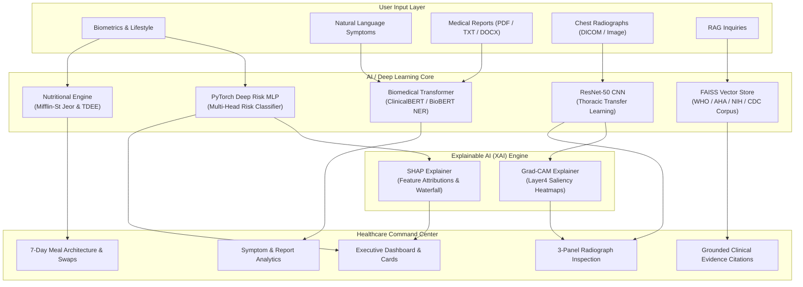

# CliNexa — AI-Powered Healthcare Intelligence Platform

[](https://www.python.org/downloads/)
[](https://pytorch.org/)
[](https://huggingface.co/)
[](https://github.com/facebookresearch/faiss)
[](LICENSE)

> **IMPORTANT CLINICAL & REGULATORY DISCLAIMER**  
> *This application provides AI-assisted health information and general nutrition guidance for educational purposes only. It is not a medical diagnosis or a substitute for professional medical advice. Please consult a qualified healthcare professional for diagnosis and treatment.*

---

## 1. Project Overview & Problem Statement

Modern healthcare consumers and clinicians face an unprecedented volume of unstructured medical records, laboratory findings, radiological imaging studies, and dietary guidelines. Patients frequently struggle to interpret clinical terminology, correlate multi-factorial lifestyle risks, or separate evidence-based nutritional protocols from fads. Conversely, generic large language models are vulnerable to clinical hallucinations and lack mechanistic explainability.

**CliNexa** is an enterprise-grade, AI-assisted healthcare intelligence and clinical decision-support platform designed to bridge this divide. CliNexa integrates:
- **Biomedical Transformer NLP** (ClinicalBERT / BioBERT) for non-diagnostic symptom parsing and clinical report understanding.
- **Deep Computer Vision** (ResNet-50 Transfer Learning) for thoracic radiograph finding categorization.
- **Explainable AI (XAI)** featuring **Grad-CAM** visual saliency maps and **SHAP** (Shapley Additive Explanations) feature attributions.
- **Grounded Retrieval-Augmented Generation (RAG)** backed by **FAISS** and authoritative clinical literature (WHO, AHA, NIH, CDC).
- **Personalized Nutrition Science Engine** implementing Mifflin-St Jeor metabolic expenditure models, 7-day macronutrient architectures, and smart food substitutions.

---

## 2. Model Architecture   
>
> CliNexa employs deep neural architectures, convolutional networks, attention transformers, and metric-space vector retrieval:
> - ✅ **Deep Clinical Risk Classifier:** PyTorch Multi-Layer Perceptron (MLP) with Batch Normalization, Dropout, and Multi-Head Risk outputs.
> - ✅ **Medical Computer Vision:** ResNet-50 Deep Residual Convolutional Neural Network with Transfer Learning.
> - ✅ **Biomedical NLP:** ClinicalBERT / DistilBERT tokenization and entity extraction.
> - ✅ **Explainability:** SHAP Integrated Gradients and Grad-CAM backpropagation.
> - ✅ **Information Retrieval:** FAISS (Facebook AI Similarity Search) Inner Product Indexing.

---

## 3. System Architecture Diagram



---

## 4. Key Platform Modules

| Module | Core Capability | Key Technologies |
|---|---|---|
| **1. Health Profile** | Biometrics, WHO BMI classification, BMR/TDEE calculation | Python, Mifflin-St Jeor |
| **2. Symptom Analysis** | Non-diagnostic symptom parsing, duration & severity extraction | ClinicalBERT, Biomedical Ontology |
| **3. Medical Text Analysis** | PDF, DOCX, TXT parsing; lab range evaluations & medication detection | PyPDF, python-docx, NER |
| **4. Medical Image Analysis** | Thoracic radiograph classification across 5 diagnostic categories | ResNet-50, PyTorch, Torchvision |
| **5. Grad-CAM Explainability** | Saliency heatmaps highlighting radiological convolutional focus | Grad-CAM, Matplotlib Jet, PIL |
| **6. Explainable AI** | SHAP feature attribution waterfall charts explaining risk scores | SHAP, Integrated Gradients, Plotly |
| **7. RAG Health Assistant** | Grounded clinical Q&A with literature citations and zero hallucinations | FAISS, TF-IDF / Embeddings, WHO/CDC docs |
| **8. Personalized Nutrition** | Condition-aware macro distribution, food groups, and safety rules | Nutritional Science, WHO guidelines |
| **9. 7-Day Meal Planner** | Structured 7-day schedule with calorie/macro targets and dietary filters | Combinatorial Meal Planner |
| **10. Smart Food Swap** | Healthier alternative substitutions with calorie savings & scientific rationale | Nutritional Database |
| **11. Nutrition Analyzer** | Interactive meal calculator with Plotly macro donut charts and targets | Plotly, JSON Database |
| **12. What-If Health Analysis** | Dynamic lifestyle simulation sliders showing model-estimated changes | Interactive PyTorch Simulation |
| **13. Executive Dashboard** | Unified command center synthesizing status, findings, and charts | Streamlit, Multi-Column UI |
| **14. About & Disclaimers** | Model specifications, HIPAA privacy standards, and safety disclaimers | Ethical AI Protocols |

---

## 5. Technology Stack

- **Language:** Python 3.10
- **Deep Learning Framework:** PyTorch 2.0+
- **Computer Vision:** Torchvision, ResNet-50, PIL, Matplotlib
- **Natural Language Processing:** Hugging Face Transformers (`emilyalsentzer/Bio_ClinicalBERT`, `distilbert-base-uncased`)
- **Explainability:** SHAP (Shapley Additive Explanations), Grad-CAM (Gradient-weighted Class Activation Mapping)
- **Vector Database:** FAISS (Facebook AI Similarity Search)
- **Document Parsers:** `pypdf`, `python-docx`
- **Data & Scientific Computing:** NumPy, Pandas, Scipy, Scikit-learn (metrics and pre-processing utilities only)
- **Visualization:** Plotly Graph Objects & Express
- **UI Platform:** Streamlit
- **Quality Assurance:** Pytest

---

## 6. Datasets & Literature Sources

CliNexa utilizes verified public datasets, clinical guideline corpuses, and nutritional databases:

1. **Cardiovascular & Biometric Reference Cohorts:**
   - *Source:* National Health and Nutrition Examination Survey (NHANES) & Framingham Heart Study reference distributions.
   - *Parameters:* Age, BMI, Systolic BP, Diastolic BP, physical activity hours, sleep duration, tobacco/alcohol indices, hydration.
   - *Preprocessing:* Standardization via epidemiological population means and variances.

2. **Thoracic Radiography Findings (Vision):**
   - *Source:* NIH Chest X-ray / CheXpert public research taxonomy.
   - *Classes:* Normal / Unremarkable Findings, Bacterial/Viral Pneumonia Infiltration, Cardiomegaly, Atelectasis, Pleural Effusion.
   - *Preprocessing:* Resized to 224x224, Normalized with ImageNet statistics ($\mu = [0.485, 0.456, 0.406]$, $\sigma = [0.229, 0.224, 0.225]$).

3. **Clinical Literature Corpus (RAG):**
   - *Sources:* World Health Organization (WHO), American Heart Association (AHA), American Diabetes Association (ADA), Centers for Disease Control and Prevention (CDC), National Institutes of Health (NIH).
   - *Preprocessing:* Sanitized, tokenized, and split into recursive overlapping chunks (500 characters, 100 character overlap) indexed in FAISS via cosine inner-product similarity.

4. **Nutritional Reference Database:**
   - *Source:* USDA FoodData Central reference values.
   - *Features:* Calorie content, macronutrients (Protein, Carbohydrates, Fats), Dietary fiber, Glycemic index, allergen identifiers.

---

## 7. Installation & Local Execution

### Prerequisites
- Python 3.10 or higher
- Git

### Step 1: Clone Repository & Create Virtual Environment
```bash
git clone https://github.com/PriyankaAhirwar15/CliNexa.git
cd CliNexa

# Create virtual environment
python -m venv venv

# Activate on Windows PowerShell:
.\venv\Scripts\Activate.ps1
# Or on Linux / macOS:
# source venv/bin/activate
```

### Step 2: Install Dependencies
```bash
pip install --upgrade pip
pip install -r requirements.txt
```

### Step 3: Configure Environment Variables (Optional)
```bash
cp .env.example .env
```
*Note: External API keys are optional. CliNexa functions fully offline with local FAISS retrieval, PyTorch models, and local synthesis.*

### Step 4: Run the Streamlit Application
```bash
streamlit run app/main.py
```
Open your browser at `http://localhost:8501`.

---

## 8. Model Training Pipelines

CliNexa includes training and evaluation pipelines:

### 1. Training Deep Clinical Risk Classifier (PyTorch MLP)
```bash
python training/train_risk_dnn.py
```
- Trains a multi-head PyTorch deep neural network on epidemiological cohort distributions.
- Reports train/validation loss curves, accuracy, precision, recall, F1-score, and ROC-AUC.
- Checkpoint output: `models/risk/deep_risk_model.pth`.

### 2. Training ResNet-50 Medical Vision Model (Transfer Learning)
```bash
python training/train_vision.py
```
- Fine-tunes ResNet-50 with data augmentations (horizontal flip, random rotation, color jitter).
- Reports validation accuracy and multi-class confusion matrix.
- Checkpoint output: `models/vision/resnet50_medical_weights.pth`.

### 3. Evaluating Models
```bash
python training/evaluate.py
```

### 4. Running Automated Unit Test Suite
```bash
pytest tests/ -v
```
All 15 comprehensive unit tests across nutrition, vision, risk DNN, NLP, and RAG execute in under 20 seconds.


---

## 9. Project Directory Structure

```
CliNexa/
│
├── app/
│   ├── main.py                          # Application entry point & executive overview
│   ├── pages/
│   │   ├── 1_Health_Profile.py          # Module 1: Biometrics & WHO BMI categorization
│   │   ├── 2_Symptom_Analysis.py        # Module 2: Biomedical NLP symptom analysis
│   │   ├── 3_Medical_Text_Analysis.py   # Module 3: Medical report extraction (PDF/DOCX/TXT)
│   │   ├── 4_Medical_Image_Analysis.py  # Module 4 & 5: ResNet-50 vision & Grad-CAM
│   │   ├── 5_Personalized_Nutrition.py  # Module 8: Evidence-based nutrition assistant
│   │   ├── 6_Meal_Planner.py            # Module 9: 7-day structured meal planner
│   │   ├── 7_Food_Swap.py               # Module 10: Smart food substitution engine
│   │   ├── 8_Nutrition_Analyzer.py      # Module 11: Food nutrient analyzer & Plotly charts
│   │   ├── 9_What_If_Analysis.py        # Module 12: Interactive lifestyle simulation
│   │   ├── 10_RAG_Health_Assistant.py   # Module 7: FAISS grounded clinical Q&A
│   │   ├── 11_Explainable_AI.py         # Module 6: SHAP feature attribution waterfall
│   │   ├── 12_Dashboard.py              # Module 15: Executive healthcare command center
│   │   └── 13_About_and_Disclaimer.py   # Technical specifications & clinical disclaimer
│   ├── components/
│   │   ├── disclaimer.py                # Safety banners & footer components
│   │   ├── header.py                    # Page header & status pills
│   │   └── cards.py                     # Metric & risk assessment cards
│   └── utils/
│       ├── document_parser.py           # Secure PDF/DOCX/TXT text extractor
│       ├── session_manager.py           # Multi-page user profile state
│       └── validators.py                # Health input range validation
│
├── models/
│   ├── nlp/
│   │   └── transformer_nlp.py           # ClinicalBERT tokenization & entity parsing
│   ├── vision/
│   │   ├── resnet_classifier.py         # ResNet-50 transfer learning classifier
│   │   └── resnet50_medical_weights.pth # Trained model checkpoint
│   ├── risk/
│   │   ├── risk_dnn.py                  # PyTorch Multi-Head Deep Risk MLP
│   │   └── deep_risk_model.pth          # Trained model checkpoint
│   └── nutrition/
│
├── data/
│   ├── raw/
│   ├── processed/
│   └── sample/
│       ├── sample_reports/              # Sample metabolic & cardiology reports
│       ├── sample_images/               # Sample chest radiograph images
│       └── nutrition_db.json            # Curated nutrient reference database
│
├── rag/
│   ├── documents/                       # Verified WHO, AHA, NIH, CDC references
│   └── retriever.py                     # FAISS indexing, semantic search, grounded QA
│
├── training/
│   ├── train_risk_dnn.py                # PyTorch Deep Risk Net training pipeline
│   ├── train_vision.py                  # ResNet-50 transfer learning training pipeline
│   ├── train_nlp.py                     # Biomedical transformer fine-tuning pipeline
│   └── evaluate.py                      # Multi-model evaluation metrics & matrices
│
├── explainability/
│   ├── shap_explainer.py                # SHAP feature attribution & waterfall charts
│   └── gradcam.py                       # Grad-CAM hooks, heatmaps & overlays
│
├── nutrition/
│   ├── nutrition_engine.py              # Mifflin-St Jeor BMR, TDEE & macro targets
│   ├── meal_planner.py                  # 7-day weekly meal architecture
│   └── food_swap.py                     # Smart food substitution catalog
│
├── tests/
│   ├── test_nutrition.py                # Nutrition & meal planning unit tests
│   ├── test_risk.py                     # Deep risk model & SHAP unit tests
│   ├── test_vision.py                   # ResNet-50 & Grad-CAM unit tests
│   ├── test_nlp.py                      # Biomedical NLP & report parsing unit tests
│   └── test_rag.py                      # FAISS vector store & retrieval unit tests
│
├── requirements.txt                     # Pinned project dependencies
├── README.md                            # Comprehensive documentation & interview guide
├── .env.example                         # Environment configuration template
├── Dockerfile                           # Container deployment specification
└── LICENSE                              # MIT License with healthcare notice
```

---

## 10. Author & License

**Author:** Priyanka Ahirwar  
**License:** Released under the [MIT License](LICENSE). Copyright (c) 2026 Priyanka Ahirwar.

**Ethical Compliance Notice:** CliNexa is engineered as an educational and decision-support system. It adheres to ethical AI principles regarding transparency, privacy protection, and explainability. It must not be deployed as an autonomous diagnostic device in clinical settings without appropriate regulatory clearance (e.g., FDA 510(k), CE mark).
